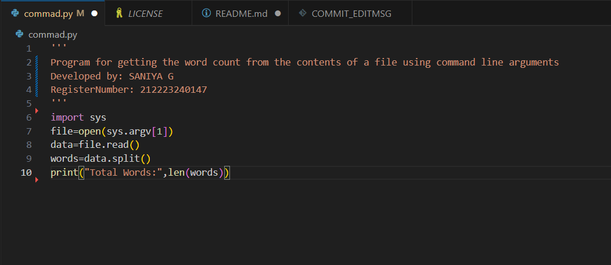
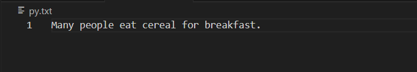
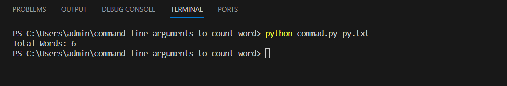

# command-line-arguments-to-count-word
## AIM:
To write a python program for getting the word count from the contents of a file using command line arguments.
## EQUIPEMENT'S REQUIRED: 
PC
Anaconda - Python 3.7
## ALGORITHM: 
### Step 1:

Import sys module

# Step 2:
Open the file with sys.argv[1]

# Step 3:
Use the for loop to select the content in file

# Step 4:
Use split function to to separate the file content into words or strings

# Step 5:
Count the length of the words using len

# Step 6:
Print the number of words

## PROGRAM:
'''
#Program for getting the word count from the contents of a file using command line arguments
#Developed by: SANIYA G
#RegisterNumber: 212223240147
'''
````
import sys
file=open(sys.argv[1])
data=file.read()
words=data.split()
print("Total Words:",len(words))
python commad.py py.txt
````
### OUTPUT:





## RESULT:
Thus the program is written to find the word count from the contents of a file using command line arguments.
